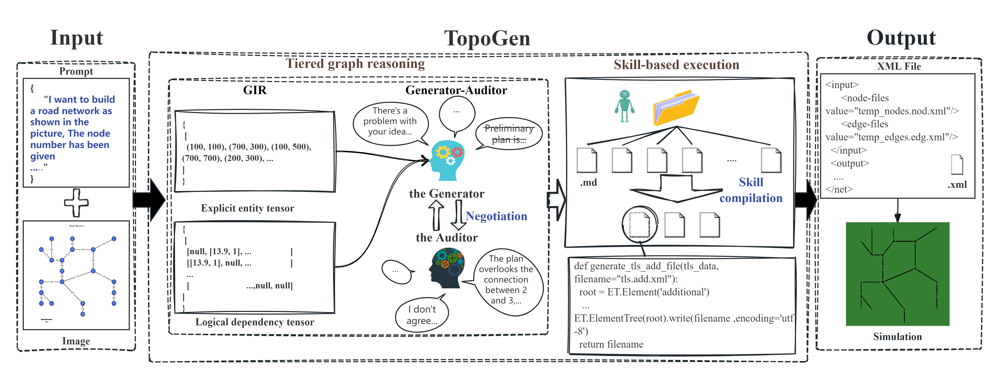
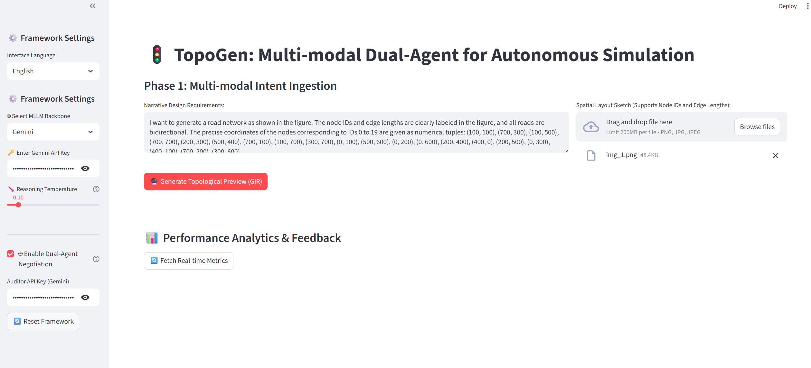

# 🚀 TopoGen: Reasoning Before Acting for Multi-modal Simulation Generation

[](https://www.python.org/)
[](https://eclipse.dev/sumo/)
[](LICENSE)

## 📖 Introduction
**TopoGen** is a neuro-symbolic framework designed to bridge the gap between high-level multi-modal design intent and low-level executable traffic simulations. By strictly decoupling **Topological Reasoning** from **Syntactic Execution**, TopoGen transforms the labor-intensive process of constructing [SUMO](https://eclipse.dev/sumo/) environments into a streamlined, interactive experience.

This project is the official implementation of the paper: *"TopoGen: Reasoning Before Acting for Multi-modal Simulation Generation"*.

---

## 🧠 System Architecture
TopoGen follows a two-stage pipeline based on the principle of **"Reasoning Before Acting"**:

1.  **Reasoning Layer (The Brain)**: Projects unstructured inputs (sketches + text) into a **Graph-based Intermediate Representation (GIR)**. It features a **Generator-Auditor negotiation loop** that iteratively refines the graph to ensure topological integrity and eliminate hallucinations.
2.  **Acting Layer (The Hands)**: A skill-based execution system. It orchestrates a library of pre-verified functional modules (Skills) to compile the GIR into deterministic SUMO XML artifacts (network, routes, and detectors).


*Figure 1: The TopoGen neuro-symbolic architecture.*

---

## ✨ Key Features
- **🔮 Multi-modal Intent Ingestion**: Support for hand-drawn sketches (spatial priors) and narrative natural language (semantic constraints).
- **🤖 Dual-Agent Negotiation**: A built-in protocol where a *Generator* proposes and an *Auditor* critiques, increasing accuracy by ~24.6% in complex scenarios.
- **🛠️ Skill-based Execution**: Orchestrates verified Python primitives to generate `.net.xml` and `.rou.xml` without manual coding.
- **📊 Traffic-Sim Bench**: Includes the first open-source benchmark for simulation generation with 120 unique scenarios.

---

## 📸 Workflow Showcase

### Step 1: Multi-modal Intent Ingestion

*Users provide high-entropy inputs including sketches and linguistic requirements.*

### Step 2: Topological Grounding & Refinement

*Interactive visualization of the GIR. Users can adjust attributes via a synchronized tabular editor.*

### Step 3: Traffic Demand & Parameter Calibration

*Calibrating vehicle composition, demand matrices, and microscopic driver models.*

### Step 4: Simulation Orchestration

*The Acting Layer invokes functional skills to launch a physically valid simulation in SUMO-GUI.*

---

## 📂 Project Structure
```text
TopoGen/
├── main.py              # Entry Point: Streamlit UI & Orchestration
├── src/                 # Core Source Code (Neuro-symbolic Engine)
│   ├── ai_logic.py      # Reasoning Layer: MLLM & Negotiation
│   ├── sumo_logic.py    # Acting Layer: Skill Library & Compilation
│   └── language.py      # i18n Support (EN/ZH)
├── dataset/             # Traffic-Sim Bench Dataset
├── assets/              # README Resources (Images/Diagrams)
└── requirements.txt     # Dependency Manifest
```
---

## 🛠️ Installation & Quick Start
```text
1. Prerequisites
Install Eclipse SUMO and configure the SUMO_HOME environment variable.
Python 3.9 or higher.
2. Setup

# Clone the repository
git clone https://github.com/ruiy7469-hue/TopoGen
cd TopoGen

# Install dependencies
pip install -r requirements.txt

3. Run
streamlit run main.py
```

---
## ⚠️ Important Notes
```
API Redundancy: For stable negotiation, providing two separate API keys is recommended to avoid rate limits.
Complexity: Optimized for road networks with fewer than 30 nodes.
Grounding: For best results, include node coordinates in text and node IDs in sketches.
```
---
## 📜 License
```
Licensed under MIT. This project is for academic and research purposes only.
```