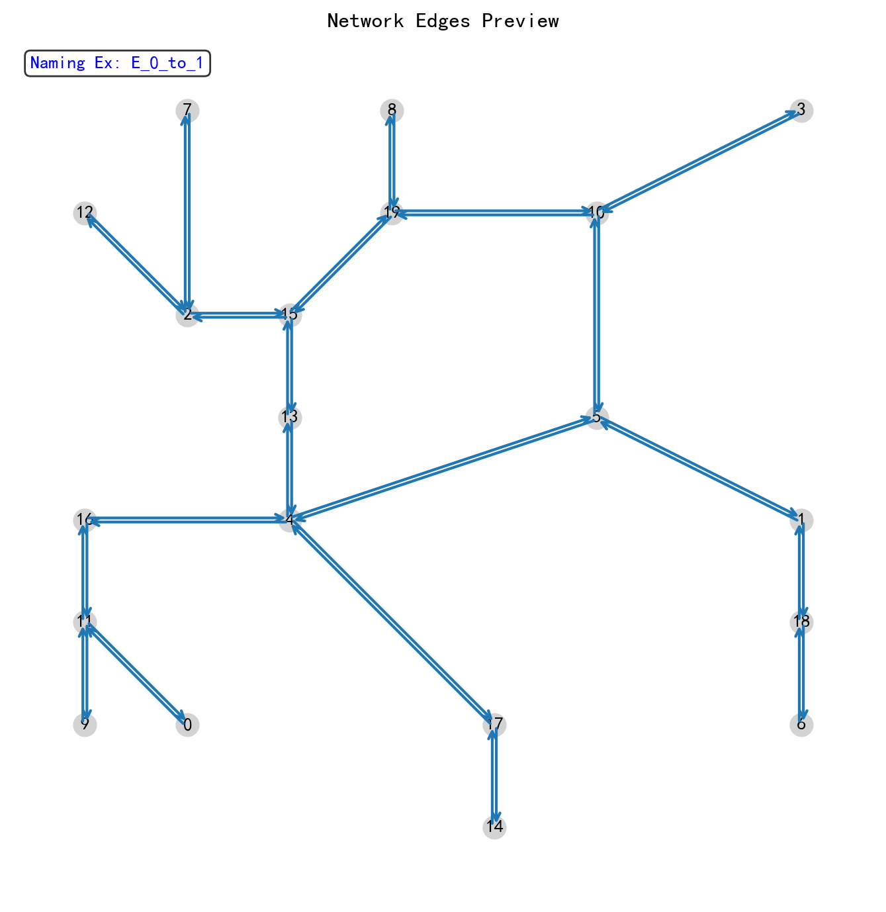
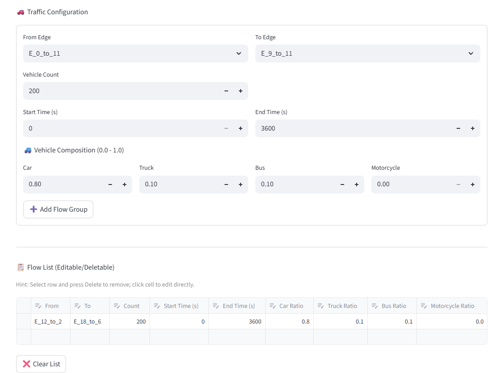

🚦 AISUMO Designer: 基于大语言模型的交互式交通仿真设计器

[](https://www.python.org/)
[](https://eclipse.dev/sumo/)
[](LICENSE)

## 📖 项目简介
本项目是一款专门为交通工程研究者和学生设计的 **SUMO 交互式辅助建模工具**。通过集成 Google Gemini 大语言模型，本项目将传统的繁琐 SUMO 脚本编写过程(仿真建立过程)转化为“自然语言描述/草图识别”的直观交互体验。

本项目也是我的毕业设计核心部分，旨在探索人工智能在城市交通仿真自动化领域的应用。

---

## ✨ 核心特性

- **🔮 AI 驱动的路网生成**：支持通过文字描述（如：“生成一个三角形路网”）或上传手绘草图自动识别交叉口坐标及道路连接。
- **🤖 双 AI 交叉验证**：内置双模型协同机制，AI1 生成方案，AI2 负责审核与修正，两个AI协调直到达成一致，大幅提高路网逻辑的准确率。
- **🗺️ 交互式人机对齐**：支持实时预览路网结构，用户可通过反馈对话框让 AI 动态调整道路属性（车道数、限速等）（也可通过列表手动修改，便捷）。
- **🚗 动态流量配置**：直观配置起始边、车辆构成（轿车、货车、公交、摩托）及流量强度，自动生成路由文件。
- **🚦 精细化仿真控制**：
  - **信号灯编辑**：支持 Actuated（感应式）和 Static（静态）信号灯相位在线调整。
  - **驾驶行为微调**：内置 Krauss、IDM、Wiedemann 等多种跟驰模型及换道模型参数设置。
  - **仿真参数设置**：可设置仿真速度，以及是否添加检测器。
- **📊 实时结果可视化**：仿真结束后自动读取检测器数据，生成路段平均速度分布图表。

---

## 📸 成果展示

### 1. 路网生成与预览

*图 1：AI 根据草图解析生成的路网结构*

### 2. 交互式流量设置
!
*图 2：车辆比例与流量分布配置界面*

### 3. SUMO 仿真运行

*图 3：自动生成的仿真场景在 SUMO-GUI 中运行*

---

## 📂 项目结构说明

```text
SUMO_AI_Designer/
├── main.py              # 程序入口：负责 Streamlit UI 布局与流程控制
├── ai_logic.py          # AI 核心：封装 Gemini 调用、JSON 解析、双 AI 验证逻辑
├── sumo_logic.py        # 仿真引擎：负责 XML 生成、netconvert 调用及绘图
├── language.py          # 国际化：存储中英文翻译字典及转换函数
├── requirements.txt     # 依赖清单：项目运行所需的 Python 库
└── .gitignore           # 忽略文件：排除缓存及仿真临时数据
```
```
##  🛠️ 环境部署
1. 安装 SUMO
请确保您的系统中已安装 Eclipse SUMO，并正确配置了环境变量 SUMO_HOME。
2. 获取 API Key
本项目需要 Google Gemini API Key 才能使用 AI 功能。请在 Google AI Studio 免费获取。
3. 安装依赖
在项目根目录下运行以下命令：
  pip install -r requirements.txt
4.快速开始
启动程序：
  streamlit run main.py
配置设置：在侧边栏输入您的 Google API Key。
分步设计：
  Step 1: 输入路网描述或上传草图。
  Step 2: 检查 AI 生成的结构，必要时通过对话框让 AI 修正。
  Step 3: 添加各路段的交通流量。
  Step 4: 调整车辆物理参数或信号灯相位，以及各种仿真参数，点击“启动仿真”。

！！！注意！！！（一定要看）
1.开启AI自查功能后，需要提供两个API（一个API可能触发Gemini请求次数限制）。
2.本项目适用于复杂度较小的路网，路网包含节点数最好在30以下。
3.经过性能实验验证，用户输入的文本最好包含节点的坐标，同时图片中最好标出节点编号。
```
```
📜 许可说明
本项目基于 MIT 许可证开源，仅供学术交流与毕业设计参考使用。
```
```
🤝 致谢
感谢所有开源社区提供的工具支持：
Eclipse SUMO Team
Streamlit
Google Generative AI
```